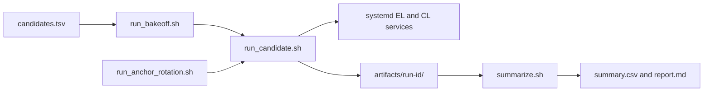

# The Bake-off Harness — Function-Level Engineering Reference

This is the deep, function-level reference for the bake-off harness. Where the results and narrative
writeups cover the measurements, orchestration model, and war stories, this document covers every script under `test/bakeoff/`, every
function it calls, every flag it reads, and the data files it produces. Read it alongside the
scripts themselves — line numbers below refer to the harness as of this writing and will drift as
the code evolves; the function/flag *names* are the stable contract.

Results and methodology are documented in `CLIENT_BAKEOFF_RESULTS.md` (the source of truth for every
number) and `CLIENT_BAKEOFF_BLOG.md` (the narrative writeup). This doc is about the *harness*, not
the findings.

---

## 1. Layout

```
test/bakeoff/
├── run_bakeoff.sh          # sequential multi-candidate orchestrator + resume guard
├── run_candidate.sh        # single-candidate driver: reset → install → caps → sample-to-verdict
├── run_anchor_rotation.sh  # multi-EL anchor-rotation driver (establish EL once, sweep CLs against it)
├── apply_resource_caps.sh  # systemd CPUQuota/MemoryMax/IOWeight apply|clear
├── lib.sh                  # shared probe/sample/config-gate library (sourced, never executed)
├── summarize.sh            # aggregates artifacts/ into summary.csv, report.md, a results skeleton
├── candidates.tsv          # the manifest: <execution>\t<consensus> pairs to run
└── test_data_dirs_sync.sh  # CI guard: BAKEOFF_DATA_DIRS must match purge_ethereum_data.sh
```

All scripts source `lib/common_functions.sh` for logging (`log_info`/`log_warn`/`log_error`) and
run under `set -Eeuo pipefail`.

### Data flow at a glance



`run_bakeoff.sh` owns the ordinary sequential sweep; `run_anchor_rotation.sh` reuses one synced
execution-layer anchor while cycling consensus clients. Both paths produce the same per-candidate
artifacts, so `summarize.sh` has one source of truth.

---

## 2. `run_bakeoff.sh` — the sequential orchestrator

Usage: `run_bakeoff.sh --stage=triage|full [--only=el__cl,el__cl,...] [--force]`

What it does, in order:

1. **Stage-dependent windows.** `--stage=triage` sets a 5400s (90 min) sync window with 120s
   sampling (`ETH2QS_BAKEOFF_SYNC_WINDOW_SECONDS`, `ETH2QS_BAKEOFF_SAMPLE_INTERVAL_SECONDS`);
   `--stage=full` sets a 259200s (72h) window with 600s sampling. Both are overridable via env
   (the script only supplies the default with `${VAR:-default}`).
2. **Config swap with restore-on-exit.** It backs up the current `config/user_config.env` to
   `config/user_config.env.bakeoff-backup`, installs `config/bakeoff.env` in its place, and
   registers `trap restore_cfg EXIT` so the operator's real config is always restored — even on
   Ctrl-C or a crash mid-run.
3. **Candidate selection from `candidates.tsv`.** The manifest is `<execution>\t<consensus>` pairs;
   `run_bakeoff.sh` turns each row into an `el__cl` pair id with `awk -F'\t' 'NF>=2{print $1"__"$2}'`.
   - `--only=a__b,c__d` explicitly overrides the manifest.
   - `--stage=full` **without** `--only` auto-selects only candidates whose triage `env.txt` already
     recorded `install_exit_code=0` — this is the resume guard: a full run only re-attempts
     candidates that passed triage, and running `--stage=full` twice is safe (it re-derives the
     same selection from disk, it doesn't remember state in the orchestrator itself).
   - `--stage=triage` with no `--only` runs every manifest row.
4. **Sequential dispatch, tolerant of failure.** For each selected pair it calls
   `run_candidate.sh "$execution" "$consensus"` with `set +e` around the call, so one candidate's
   non-zero exit does not abort the sweep; the exit code is appended to
   `artifacts/<run-id>/orchestrator-<stage>.log`.
5. **Always calls `summarize.sh`** at the end (`|| log_warn`, non-fatal if it errors).

Artifact root: `artifacts/${ETH2QS_BAKEOFF_RUN_ID:-client-bakeoff-2026-06-22}/`. Every subsequent
script keys off the same env var, so a fresh campaign is just a new `ETH2QS_BAKEOFF_RUN_ID`.

---

## 3. `run_candidate.sh` — the single-candidate state machine

Usage: `run_candidate.sh <execution> <consensus>`. This is the workhorse; every candidate row in
the results tables is one invocation of this script. It refuses to run at all unless
`ETH2QS_BAKEOFF_CONFIRMED=yes` is set (`log_error … exit 2`) — a deliberate manual safety gate
because the script purges data directories and stops/disables services.

### 3.1 Modes

The script has three modes, selected by env vars, all mutually aware of each other:

| Mode | Trigger | Behavior |
|------|---------|----------|
| **full** (default) | neither var set | stop+disable+purge *both* EL and CL, install both, sync both |
| **establish** | `ETH2QS_BAKEOFF_KEEP_EL=yes` | same as full, but on teardown only the CL datadir is purged — the EL is left running and synced, to become the next anchor |
| **anchor** | `ETH2QS_BAKEOFF_ANCHOR_EL=<el>` | only stop/disable/purge the CL; the EL must already be active and synced; only the CL is installed and cycled |

Anchor mode has its own precondition gate before touching anything: the `$execution` arg must equal
`$ETH2QS_BAKEOFF_ANCHOR_EL` (mismatch → `exit 3`), `eth1.service` must be `systemctl is-active`,
Engine API port 8551 must answer with an HTTP-shaped code (`^[1-5][0-9]{2}$`, since 401 auth-required
counts as "responding"), and a bounded 5-retry/2s-sleep loop must observe `eth_syncing` resolve to
"caught up" (`result == false`, or a progress object where `currentBlock == highestBlock` and
`highestBlock != "0x0"`) before the CL sweep is allowed to start.

### 3.2 Resume guard

If `$out/.done` exists and `ETH2QS_BAKEOFF_FORCE` isn't `yes`, the candidate is skipped entirely
(`exit 0`). Setting `ETH2QS_BAKEOFF_FORCE=yes` also clears `.anchor-poisoned` and `.done` so a forced
rerun doesn't inherit a stale poison marker from a previous attempt — without that clear, the
anchor watchdog guard later in the script would bypass itself and finalize `anchor_synced=no` for
what is actually a clean rerun.

### 3.3 Pre-install sequence

1. Stop+disable the relevant services (`eth1.service cl.service validator.service`, or just
   `cl.service validator.service` in anchor mode) — `2>/dev/null || true`, tolerant of units that
   don't exist yet.
2. Purge datadirs via `./scripts/eth2qs.sh clean-data` — `--dry-run` first (logged, non-fatal),
   then `--confirm` (must succeed). Anchor mode passes `--scope=consensus` so the EL anchor is never
   touched. `< /dev/null` on every `clean-data` and install call prevents `SIGTTIN` when the harness
   runs detached (backgrounded/tmux) — a non-interactive process group reading from a controlling
   TTY gets stopped by the kernel, not an error the script can catch.
3. `bakeoff_snapshot_disk "$out/disk-before.tsv"` — baseline footprint.
4. **Disk-floor guard**, checked via `df -B1 --output=avail /`: anchor mode requires
   `ETH2QS_BAKEOFF_MIN_DISK_BYTES:-429496729600` (400 GiB — CL-only, since the EL already occupies
   disk), full mode requires `:-1717986918400` (1.6 TiB — full EL+CL). Below the floor, the script
   aborts with `exit 3` *before* starting an install that would fail hours later from `ENOSPC`.
5. `./scripts/eth2qs.sh plan|doctor|stats --json` snapshots, best-effort (`|| true`).
6. Opportunistic `GITHUB_TOKEN` export from `gh auth token` if neither `GITHUB_TOKEN` nor `GH_TOKEN`
   is already set — avoids the 60/hr unauthenticated GitHub API rate limit during client-version
   lookups inside the install scripts.

### 3.4 Install

```
timeout "$install_timeout" /usr/bin/time -v -o "$out/install-time.txt" \
  ./scripts/eth2qs.sh phase2 --execution="$execution" --consensus="$consensus" --mev=none \
  </dev/null > "$out/install.log" 2>&1
```
(Anchor mode omits `--execution=` since only the CL installs.) `install_timeout` defaults to `90m`
(`ETH2QS_BAKEOFF_INSTALL_TIMEOUT`). `/usr/bin/time -v` is what `summarize.sh` later parses for
install wall-clock (see §6). The exit code is captured with `set +e`/`set -e` bracketing and written
to `env.txt` as `install_exit_code=`.

Immediately after install: `apply_resource_caps.sh apply` (§4), then a battery of post-install
snapshots (`doctor`, `stats`, `monitor export`, `debug --service eth1`, `debug --service cl`,
`systemctl status eth1 cl validator`), then the config-optimality gate,
`bakeoff_check_config_optimal` (§5.5) — non-blocking, it stamps `config_optimal=yes|no` into
`env.txt` and never aborts the run.

### 3.5 Observation window

Skipped entirely if `install_rc != 0`. Otherwise a `while` loop runs until
`$(date +%s) >= end_at` (`end_at = now + window`), sleeping `interval` seconds between iterations.
Each iteration:

1. `bakeoff_write_sample "$out" "$REPO_ROOT"` — the sampling primitive (§5.4).
2. `bakeoff_services_alive` check — sets `crashed=yes` if either service unit is no longer active
   (this becomes `service_crash_observed` in `env.txt`, a hard fail signal downstream).
3. **Anchor watchdog** (anchor mode only, and only while `.anchor-poisoned` doesn't already exist):
   detects if the anchor EL silently dropped out of sync (service down, or `eth_syncing` no longer
   reporting caught-up). Two consecutive misses (`anchor_miss_streak -ge 2`) touches
   `.anchor-poisoned` and logs an error — **detection only, it never restarts or kills anything**,
   because the anchor EL is shared state across the whole CL sweep and killing it would invalidate
   every remaining candidate in the rotation.
4. **Stall watchdog** (opt-in via `ETH2QS_BAKEOFF_STALL_RESTART=yes`, inert otherwise): tracks
   `no_progress_streak` — the CL's `head_slot` (or, if absent, a `sync_distance`-derived proxy) in
   anchor mode, or the EL's `currentBlock` (hex-decoded) otherwise. `stall_samples` (default 10)
   consecutive non-advancing samples triggers `sudo systemctl restart` on the stalled unit, up to
   `stall_max_restarts` (default 3) times; exceeding that touches `.stalled`, writes
   `stall_restarts=`/`stall_failed=yes` to `env.txt`, and breaks the loop — the row is invalid past
   that point but the harness still finalizes cleanly rather than hanging forever on a genuinely
   dead node.
5. **Synced-streak check**: `bakeoff_is_synced` (§5.3) must return true on **two consecutive**
   samples (`synced_streak -ge 2`) before the row is accepted as synced — a single true reading can
   be a race between the EL and CL heads. On that streak, it snapshots `disk-synced.tsv`, writes
   `synced_at_utc=`/`fully_synced=yes`, and breaks out of the window early (no need to wait for the
   full 72h cap once synced).

After the loop (whether by break or timeout), one final `bakeoff_write_sample` call captures the
end state, then `env.txt` gets `fully_synced=no` if nothing set it, `service_crash_observed=`, and
(anchor mode only) `anchor_synced=yes|no` depending on whether `.anchor-poisoned` exists.

### 3.6 Teardown

`journalctl` tails (`-u eth1 -n 700`, `-u cl -n 700`, `-u validator -n 300`) and
`./scripts/eth2qs.sh repair` preview are captured regardless of outcome. A `findings.md` skeleton is
seeded with the install/crash verdict for a human reviewer to fill in (`Result: TBD-by-reviewer`).
`bakeoff_snapshot_disk "$out/disk-final.tsv"` captures the footprint pre-cleanup (synced or capped —
this is what `summarize.sh` falls back to when `disk-synced.tsv` doesn't exist). Then
`apply_resource_caps.sh clear`, then `clean-data` again (scoped the same way as pre-install), then a
final `disk-after-cleanup.tsv` snapshot, `ended_at_utc`, `touch .done`, and `exit "$install_rc"`.

---

## 4. `apply_resource_caps.sh` — systemd runtime caps

Usage: `apply_resource_caps.sh <apply|clear>`. Purpose: keep the bake-off from starving co-resident
work on a shared host by capping the node stack to roughly 8 cores / 36G total.

- `cap_unit <unit> <prop...>` guards on `systemctl cat "$unit"` existing (skips with a warning if
  the unit isn't defined yet) and applies each property with
  `sudo systemctl set-property --runtime <unit> <prop>` — `--runtime` means these are transient,
  gone on reboot, never written into the unit file.
- `apply`: `eth1.service` gets `CPUQuota=600% MemoryMax=24G MemoryHigh=22G IOWeight=50`; `cl.service`
  gets `CPUQuota=200% MemoryMax=12G MemoryHigh=11G IOWeight=50`.
- `clear`: resets both units' `CPUQuota`/`MemoryMax`/`MemoryHigh`/`IOWeight` back to
  infinity/infinity/infinity/100 — deliberately **not** `systemctl revert`, because these are custom
  units and `revert` can strip unit overrides/definitions entirely, not just the runtime properties
  this script set. In anchor mode, `clear` explicitly skips reverting `eth1.service` (`ETH2QS_BAKEOFF_ANCHOR_EL`
  set) so the anchor's caps stay consistent for the rest of the CL sweep; only `cl.service` reverts.

---

## 5. `lib.sh` — the shared probe/sample/gate library

Sourced by `run_candidate.sh` and `run_anchor_rotation.sh`. Never executed directly.

### 5.1 `BAKEOFF_DATA_DIRS`

The canonical list of every client datadir the harness knows about (`$HOME/.ethereum`,
`$HOME/.local/share/nethermind`, … through `$HOME/ethgas`). This array **must** stay in sync with
the `DATA_DIRS` arrays in `install/utils/purge_ethereum_data.sh` — `test_data_dirs_sync.sh` is a CI
guard that fails the build if they drift (it diffs the two lists rather than sourcing
`purge_ethereum_data.sh`, since sourcing it would invoke `main` and run the actual purge).

### 5.2 Snapshot/probe primitives

- `bakeoff_snapshot_disk <outfile>` — for every path in `BAKEOFF_DATA_DIRS` that exists, writes
  `path\tbytes\thuman` using `du -sb`/`du -sh`, then a final `filesystem:/` row from `df -B1 /`. The
  `du` calls are `2>/dev/null` with `|| true` after the `awk` — `du` can exit non-zero on a file that
  vanishes mid-walk (a live datadir churning during snapshot), and `|| true` keeps the number that
  *was* printed instead of letting `pipefail` propagate a fatal exit into an unguarded caller.
- `bakeoff_probe_execution_sync` — `curl -sS --max-time 5` to `http://127.0.0.1:8545` with an
  `eth_syncing` JSON-RPC payload; on curl failure, prints `{"error":"execution_rpc_unavailable"}`
  instead of failing, so downstream `jq` always has valid JSON to parse.
- `bakeoff_probe_beacon_sync` — tries four ports in order (`3500`, `5051`, `5052`, `9596` — the
  different consensus clients' REST API defaults) against `/eth/v1/node/syncing`, returns the first
  non-empty body; falls back to `{"error":"beacon_rest_unavailable"}`.
- `bakeoff_snapshot_processes` — `ps -eo` filtered by an `awk` regex over known client binary/comm
  names, converted to a JSON array via `jq -R -s 'split("\n")[:-1]'`.
- `bakeoff_services_alive` — `systemctl is-active --quiet eth1.service && systemctl is-active --quiet cl.service`.

### 5.3 `bakeoff_is_synced`

Returns 0 only when **both** layers report caught-up:
- Beacon: `.data` present, `sync_distance <= 4`, `is_optimistic == false`, `el_offline == false`.
- Execution: `eth_syncing` result is boolean `false`, OR a progress object where
  `currentBlock == highestBlock` **and** `highestBlock != "0x0"` (the `!= "0x0"` guard rejects the
  pre-sync zero state, where an EL that hasn't started downloading anything yet would otherwise
  read as trivially "caught up").

### 5.4 `bakeoff_write_sample <out_dir> <repo_root>`

The per-tick sampling routine. Writes disk/execution-sync/beacon-sync/process snapshots plus
`./scripts/eth2qs.sh doctor --json` and `stats --json` (each `timeout 30`, best-effort) into a
`tmp/` scratch dir, determines `alive="up"/"down"` via `bakeoff_services_alive`, and assembles one
JSON object per call with `jq -cn --rawfile` (each raw file parsed with `fromjson?  // {raw: ...}` so
a malformed sub-output degrades to a raw-string field instead of aborting the whole sample) appended
as one line to `samples.jsonl`. A `jq` failure on the whole assembly is caught and logged
(`log_warn`) rather than propagated — one bad sample should never kill the observation loop.

### 5.5 `bakeoff_check_config_optimal <el> <cl> <out_dir>`

The config-optimality gate — arguably the harness's most important correctness mechanism, since a
disk-footprint benchmark is meaningless if you can't prove the client was actually running in its
most disk-efficient mode. Non-blocking (always returns 0), but stamps a verdict that later filters
the results tables.

Mechanism:
1. Pull the running `ExecStart` line from each systemd unit: `systemctl cat eth1.service | grep -i ExecStart`
   (same for `cl.service`).
2. Extract any config file path referenced on that line. Three flag styles are matched in one
   `grep -oP` alternation: `--config-file=`/`--config-file `, `--rcConfig=`/`--rcConfig ` (lodestar),
   and `--config=`/`--config ` (erigon). The comment in the source notes why the `--config` alternative
   doesn't falsely match a `--config-file=x` line: PCRE lookbehind is position-anchored, so
   `(?<=--config[= ])` only fires when the character immediately after `--config` is `=` or a space —
   for `--config-file=x` that character is `-`, so the lookbehind never fires there.
3. If the extracted path exists as a file, its contents are appended to the "combined" haystack
   alongside the `ExecStart` line — so tokens can live in either the command line or the config file.
4. `_has_token <label> <pattern> <haystack>` runs `grep -qP -- "$pattern" "$haystack"`; the `--`
   before the pattern is required because several patterns start with a dash (e.g.
   `--prune-storage`) and without `--` those would be parsed as a `grep` option and silently
   swallowed by the `2>/dev/null` as a false "miss".
5. Per-client token table (kept current with what the install scripts actually emit):

   | Client | Token checked |
   |--------|---------------|
   | geth | `history.chain` present |
   | nethermind | `AncientBodiesBarrier` present **and** `PivotNumber` extracted and `> 0` (a zero pivot means snap sync is inert) — the pivot regex handles Nethermind's quoted-JSON form (`"PivotNumber": 15900000,`) with an optional closing quote between the key and the separator |
   | erigon | `prune.mode` set to `full`, matching both YAML-colon (`prune.mode: "full"`) and `=` separator styles, quotes optional |
   | reth | both `--prune.bodies.pre-merge` **and** `--prune.receipts.pre-merge` present |
   | besu | `history-expiry-prune=true` |
   | nimbus_eth1 | `prune = true` |
   | ethrex | no history-prune lever exists, so "optimal" is redefined as `--syncmode snap` being present |
   | prysm | `beacon-db-pruning` (flag or config-key form) |
   | lighthouse | `checkpoint-sync-url` present (default pruning behavior is already fine) |
   | teku | `data-storage-mode` set to `minimal` or `prune`, case-insensitive |
   | nimbus (CL) | `history = prune` in the persistent config — deliberately **not** checking `trustedNodeSync`/`--trusted-node-url`, because those only appear in the one-shot bootstrap subcommand that runs *before* the service starts, never in the persistent `ExecStart` or `nimbus.toml`, so they're unobservable here and out of scope for this "is the running config optimal" gate |
   | lodestar | `pruneHistory=true` (or `chain.pruneHistory`) |
   | grandine | `--prune-storage` present |

6. Any client not in the table falls through to `unchecked` (counted as found, not a miss) — the
   gate is additive; adding a new client without a token entry doesn't silently fail existing runs.
7. Writes `config_optimal=yes|no` and `config_optimal_detail=found=...;missed=...` into
   `$out_dir/env.txt`. On a miss, also `touch $out_dir/.config-not-optimal` and `log_error`.

This is the mechanism behind the "Superseded — non-optimal config" and "optimal config only" table
split in `summarize.sh`'s generated results skeleton (§6) — a row only counts toward the ranked
results if every applicable token for its EL and CL was found.

---

## 6. `run_anchor_rotation.sh` — multi-EL anchor rotation

Usage: `run_anchor_rotation.sh <anchors_csv> [<cls_csv>]` (CLs default to
`lighthouse,teku,nimbus,lodestar,grandine`). This is how the CL matrix (§ of the blog) gets measured
against more than one EL anchor without re-syncing every EL from scratch for every CL.

Per anchor in `<anchors_csv>`:
1. **Establish**: unset `ETH2QS_BAKEOFF_ANCHOR_EL`, set `ETH2QS_BAKEOFF_KEEP_EL=yes`, call
   `run_candidate.sh <anchor> prysm` — a normal full-mode candidate run (wipes any prior EL, installs
   fresh, syncs to tip) except that teardown preserves the EL datadir instead of purging it.
   The script also overrides `ETH2QS_BAKEOFF_SYNC_WINDOW_SECONDS` to `259200` (72h) by default even
   for what looks like a "just establish it" step — the source comment explains why: `run_candidate.sh`'s
   own default window is 5400s (a 90-minute smoke-test default), which would make a genuine
   multi-hour EL sync report `fully_synced=no` and silently skip the entire CL sweep for that anchor.
2. **Tip check**: reads `artifacts/<run-id>/<anchor>__prysm/env.txt` and requires
   `fully_synced=yes`. If missing or not `yes`, logs a warning and **skips the CL sweep for this
   anchor entirely** (`continue`) rather than running a CL sweep against an EL that never reached
   head.
3. **CL sweep**: exports `ETH2QS_BAKEOFF_ANCHOR_EL=<anchor>`, then calls
   `run_candidate.sh <anchor> <cl>` for every CL in `<cls_csv>` — each invocation runs in anchor mode
   (§3.1), purging only the CL datadir between candidates and reusing the live, already-synced EL.
4. Unsets `ETH2QS_BAKEOFF_ANCHOR_EL` and moves to the next anchor in the list — establishing the
   next anchor's `run_candidate.sh` call will purge the *previous* anchor's EL datadir as part of its
   own normal pre-install cleanup, which is the "rotation."

Same `ETH2QS_BAKEOFF_CONFIRMED=yes` gate as `run_candidate.sh`. All results land in the same
`artifacts/<run-id>/<el>__<cl>/` layout as a direct `run_candidate.sh` call, so `summarize.sh` needs
no special-casing for anchor-mode rows. Ends by calling `summarize.sh` itself.

---

## 7. `summarize.sh` — aggregation

Reads every `artifacts/<run-id>/<el>__<cl>/` directory and produces three outputs, none of which
overwrite the hand-curated `docs/CLIENT_BAKEOFF_RESULTS.md` (that file is the blog's source of truth
and this script never touches it):

- **`summary.csv`** — one row per candidate: `pair,execution,consensus,install_exit_code,crash,
  sample_count,last_doctor_status,last_disk_bytes,residual_bytes,config_optimal,
  config_optimal_detail,fully_synced,sync_duration,sync_only,last_el_block,el_bytes,cl_bytes,
  anchor_synced`.
  - **Sync-time derivation**: `_epoch` converts `started_at_utc`/`synced_at_utc` ISO-8601 stamps to
    epoch seconds (`date -u -d ... +%s`); their difference is `total_s`. `_install_wall_s` parses the
    `Elapsed (wall clock)` line out of `/usr/bin/time -v`'s `install-time.txt` (handles both `h:mm:ss`
    and `m:ss.dd` forms). `sync_only_s = total_s - install_s` isolates sync time from install time;
    negative results are discarded (clamped to empty) rather than shown as a nonsense negative duration.
    `_fmt_hm` renders seconds as `XhYYm`.
  - **Last EL block**: hex-decodes `execution_sync.result.currentBlock` from the last `samples.jsonl`
    line — a progress proxy even for candidates that hit the 72h cap without finishing.
  - **Per-layer disk split**: `el_bytes`/`cl_bytes` partition the chosen disk TSV (`disk-synced.tsv`
    if synced, else `disk-final.tsv`) by basename match against EL/CL basenames extracted from
    `install/utils/purge_ethereum_data.sh`'s `EL_DATA_DIRS`/`CL_DATA_DIRS` arrays via `awk`+`gensub` —
    exact basename matching so e.g. `nimbus-eth1` and `nimbus` are never confused.
- **`process-summary.csv`** — per-pair count of process-telemetry rows captured across the run
  (`jq -r '.processes[]?'` count from `samples.jsonl`).
- **`report.md`** — a human-readable dump: the `summary.csv` table (via `column -s, -t`) plus every
  candidate's `findings.md`, concatenated.
- **A generated results skeleton** at `$artifact_root/CLIENT_BAKEOFF_RESULTS.generated.md`
  (gitignored — never the committed `docs/CLIENT_BAKEOFF_RESULTS.md`), row-split into three sections
  by the `config_optimal` column:
  - **"Results (optimal config only)"** — `config_optimal=yes` and `anchor_synced != no`.
  - **"Superseded — non-optimal config"** — `config_optimal=no`, explicitly excluded from ranking
    with a note that footprints aren't comparable.
  - **"Pre-gate — unknown config"** — no verdict recorded at all (pre-gate or triage-only rows).
  Plus placeholder `## Recommendation` / `## Final synced disk footprint` / `## Changes driven by
  this bake-off` sections with HTML comments telling the human reviewer what to fill in — this file
  is a *skeleton* for the curated doc, not a replacement for it.

---

## 8. Data model reference

| File | Written by | Contents |
|------|-----------|----------|
| `env.txt` | `run_candidate.sh` (append-only through the run) | Key-value run metadata: `execution=`, `consensus=`, `mev=`, `started_at_utc=`, `sync_window_seconds=`, `sample_interval_seconds=`, `install_timeout=`, `harness_mode=full\|establish\|anchor`, `anchor_el=` (if set), `install_exit_code=`, `config_optimal=yes\|no`, `config_optimal_detail=`, `fully_synced=yes\|no`, `synced_at_utc=` (if synced), `service_crash_observed=`, `stall_restarts=`/`stall_failed=yes` (if the stall watchdog fired), `anchor_synced=yes\|no` (anchor mode only), `ended_at_utc=` |
| `samples.jsonl` | `bakeoff_write_sample` (one JSON line per tick) | `timestamp_utc`, `services_alive`, `disk_tsv` (raw TSV text), `execution_sync`, `beacon_sync`, `processes`, `doctor`, `stats` |
| `disk-before.tsv` / `disk-synced.tsv` / `disk-final.tsv` / `disk-after-cleanup.tsv` | `bakeoff_snapshot_disk` at four checkpoints | `path\tbytes\thuman` rows per `BAKEOFF_DATA_DIRS` entry that exists, plus a `filesystem:/` row |
| `candidates.tsv` | manifest (hand-edited) | `<execution>\t<consensus>` rows — the source list `run_bakeoff.sh` expands into `el__cl` pair ids |
| `install.log` / `install-time.txt` | `run_candidate.sh` install step | stdout+stderr of `phase2`, and `/usr/bin/time -v` resource/wall-clock accounting |
| `findings.md` | `run_candidate.sh` teardown (seeded, human-completed) | Install/crash verdict skeleton for reviewer sign-off |
| `.done` / `.anchor-poisoned` / `.config-not-optimal` / `.stalled` | marker files | Resume guard, anchor-invalidation flag, config-gate miss flag, stall-watchdog exhaustion flag — all checked by filename existence, never by content |
| `summary.csv` / `process-summary.csv` / `report.md` / `CLIENT_BAKEOFF_RESULTS.generated.md` | `summarize.sh` | Aggregated, gitignored — inputs for a human to curate into the committed `CLIENT_BAKEOFF_RESULTS.md` |

---

## 9. Hardening fixes visible in the code

These are defensive patterns baked into the harness as a result of real failures during the
campaign (see `CLIENT_BAKEOFF_ISSUES_LOG.md` for the incidents that motivated them):

- **`du`/pipefail resilience** (`bakeoff_snapshot_disk`): `du -sb ... || true` survives a datadir file
  vanishing mid-walk during a live sync.
- **Capped-path capture** (`_has_token` in `bakeoff_check_config_optimal`): the `--` before
  dash-prefixed patterns prevents `grep` from misparsing a pattern like `--prune-storage` as an
  option flag, which would otherwise exit 2 and get silently absorbed by `2>/dev/null` into a false
  "miss."
- **`</dev/null` on every non-interactive command** (`clean-data`, `phase2` install): prevents
  `SIGTTIN` when the harness runs detached from a controlling terminal (background process group).
- **Stall watchdog** (`ETH2QS_BAKEOFF_STALL_RESTART`): entirely opt-in and inert by default; bounded
  restart count so a genuinely dead client still terminates the observation loop with a `.stalled`
  marker rather than looping until the window cap.
- **Anchor-poison detection is read-only**: the watchdog that guards a shared anchor EL during a CL
  sweep only ever marks state (`.anchor-poisoned`) and logs — it never intervenes, because
  restarting or killing a shared anchor would invalidate every remaining candidate in the rotation,
  not just the current one.
- **FORCE-rerun poison-marker clear**: `ETH2QS_BAKEOFF_FORCE=yes` clears `.anchor-poisoned` and
  `.done` together — without this, a stale poison marker from a previous attempt would silently
  survive a forced rerun and falsely finalize `anchor_synced=no` for an otherwise clean run.
- **Two-consecutive-sample sync confirmation** (`synced_streak -ge 2` in `run_candidate.sh`,
  `synced_streak` local to the observation loop): guards against a single racy sample where the EL
  and CL heads transiently appear caught up.

---

## See also

- The repository's narrative and methodology documents explain the agent-orchestration model, the 23-day timeline, and the war stories behind the hardening fixes above.
- `CLIENT_BAKEOFF_RESULTS.md` — the numbers, source-of-truth.
- `CLIENT_BAKEOFF_BLOG.md` — the narrative writeup of the findings.
- `CLIENT_BAKEOFF_ISSUES_LOG.md` — the incident log that motivated several of the hardening fixes above.
