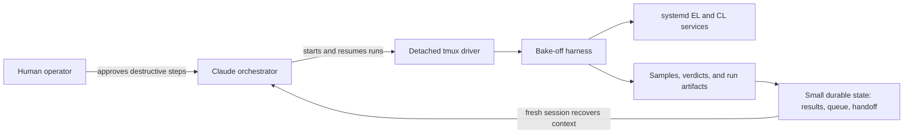
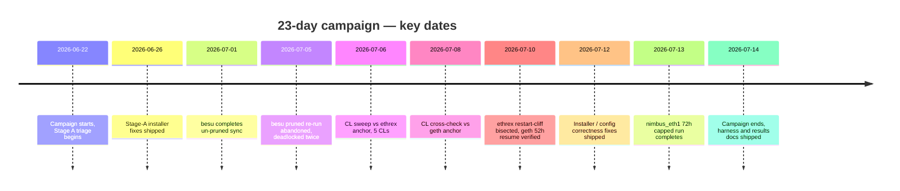
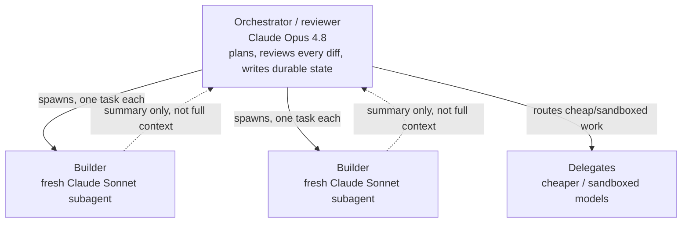
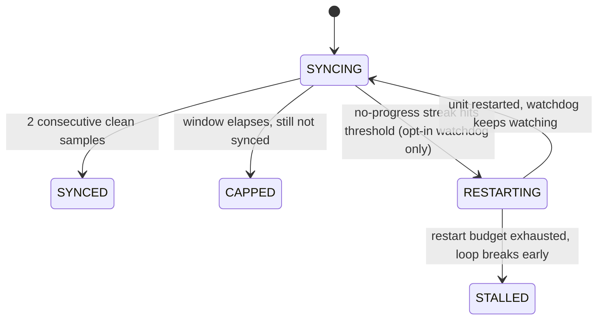

# How We Ran a 23-Day Ethereum Client Bake-Off With Claude

*A companion to [the results write-up](CLIENT_BAKEOFF_BLOG.md). That post is about the clients. This one is about the machine that tested them: the agent orchestration model, the harness we built to keep ourselves honest, and what actually breaks when a benchmark runs for three weeks on a shared host with an AI in the driver's seat.*

The [client bake-off](CLIENT_BAKEOFF_BLOG.md) measured, for every execution and consensus client [eth2-quickstart](https://github.com/chimera-defi/eth2-quickstart) supports, two numbers: final synced disk footprint and sync duration. In practice that meant **seven execution-client syncs** against fixed Prysm, then a **five-way consensus-client sweep** against a fixed execution client (Prysm was held constant only for the execution-client sweep) — one candidate at a time, on one shared semi-production host, from **June 22 to July 14, 2026 — 23 days end-to-end**.

A campaign that long, that sequential, and that easy to get subtly wrong is exactly the kind of work you don't want a human babysitting around the clock. So we didn't — it was run by **Claude** (Opus orchestrating, fresh Sonnet subagents building, delegate models for the cheap and sandboxed work), with a human operator holding the few levers that genuinely need one.

> **Up front, honestly:** this was AI-*driven*, not AI-*unsupervised*. Every destructive action against the live node was gated behind an explicit human confirmation, every result was committed under conventional-commit review, and no agent could merge its own pull request. The interesting claim here is not "the AI did it alone" — it's that the *right division of labor* between an agent and an operator let a 23-day, disk-and-timing-sensitive benchmark run to completion without a person watching it sync.

## Contents

- [TL;DR](#tldr)
- [At a glance](#at-a-glance)
- [The shape of the problem](#the-shape-of-the-problem)
- [The orchestration model](#the-orchestration-model)
- [The harness](#the-harness)
- [What we'd tell the next person](#what-wed-tell-the-next-person)
  - [Honest limitations](#honest-limitations)
- [Reproduce it](#reproduce-it)

---

## TL;DR

- **Two clocks, then a third nobody expects.** Node wall-clock (detached systemd) and agent wall-clock (event-driven wakeups) are the obvious bottlenecks. The real one is **agent context** — solved by pushing conclusions down to the data and keeping durable state in small files.
- **Three-tier agent hierarchy for context economy.** Opus orchestrator (plans, reviews every diff) → fresh Sonnet builders (implement, report back a summary) → delegate models (cheap and sandboxed work).
- **Non-negotiable governance, not vibes.** One candidate at a time, a 72-hour cap, destructive actions gated behind explicit human confirmation, only a human merges.
- **Four real incidents, all fixed or explicitly documented** — see the table below.
- **The headline numbers hide operational limits.** ethrex is the fastest cold-sync in the field but is not production-ready as tested: a 26-minute/132-block restart gap stalled, longer measured gaps caused a full re-snap, and its datadir kept growing at tip. besu did sync successfully; its pruned re-run exposed fragility after a prolonged outage of the pinned Prysm version.

## At a glance

| Client | What happened | Root cause | Resolution | Status |
|---|---|---|---|---|
| **nethermind** | 13.3h silent stall — head frozen at block 4,651, 0 peers, everything else looked healthy | P2P bind pinned to loopback (`Network.LocalIp=127.0.0.1`) | Advertise the real external IP | ✅ Fixed — production-viable |
| **besu** | Mid-sync deadlock — downloader thread died, process stayed alive and kept answering RPC | Stale pinned CL (prysm v7.1.5) stalled the beacon ~28h; snap-sync pivot aged out of the ~25-min servable-state window | None available (upstream CL issue) — keep CL binaries current; harness gained a stall-watchdog | ⚠️ Fragile to a prolonged CL outage |
| **ethrex** | Gaps through 23 min / 124 blocks resumed; a 26 min / 132 block gap stalled, and measured 1.5–2h gaps discarded state and re-snapped (~2h). The un-pruned datadir also grew at tip (~286 → ~467 GiB) | Old head ages out of the ~128-block servable-state window; beyond it the head can freeze and longer gaps can trigger a full snap instead of importing the gap | None — inherent to current design (v19.0.0) | ❌ **Not production-ready as tested.** Fastest cold sync in the field, but the likely explanation for its ~0% adoption; young client, may improve |
| **erigon** | Head froze a few thousand blocks behind tip; consensus stayed `is_optimistic=true` indefinitely | Genuine gap-close deadlock, erigon3 OtterSync vs. checkpoint-synced Prysm — not resource starvation | None — terminated per operator decision, recorded as a no-sync | ❌ No-sync on this host/CL combination |

*The durable control loop: the artifacts carry the campaign forward; a new orchestrating session reads the small durable state instead of reconstructing a run from raw logs.*

*Every date here is a shipped fix or a completed measurement run — sourced from [`CLIENT_BAKEOFF_RESULTS.md`](CLIENT_BAKEOFF_RESULTS.md) and the repo's merged-PR history, not reconstructed from memory.*

---

## The shape of the problem

Benchmarking a sync client is deceptively expensive:

- **It's slow.** A single mainnet sync ranges from ~2 hours (ethrex, snap) to *never finishes in three days* (the full-sync-only clients). Each candidate got a **72-hour cap**.
- **It's sequential.** One shared host, one execution slot, one consensus slot — geth and nethermind side by side would contend for CPU, IO, and peers, so candidates run **strictly one at a time**.
- **It's easy to measure the wrong thing.** A client that "installed and followed the chain" can be silently broken (0 peers, frozen head); a datadir means nothing if it's running in archive mode; a footprint sampled mid-compaction over-counts.
- **It's destructive.** Measuring the next client means wiping the last one's datadir on a shared box that also runs other people's work.

Multiply that across the whole supported field of clients and three weeks and you have a task defined less by any single hard step than by *sustained correctness* — the discipline to run the same careful protocol dozens of times, preserve the terminal measurement before teardown, and never let a shared-host quirk masquerade as a client property. That is what the harness and the orchestration model exist to enforce.

---

## The orchestration model

The core design choice was to **decouple node wall-clock from agent wall-clock**, and then to decouple **durable state from agent context**. Get those two right and a three-week campaign stops needing a three-week attention span.

### 1. The node runs; the agent doesn't watch it run

Every client runs as a **native systemd service** (`eth1.service`, `cl.service`, no Docker) in a **detached `tmux` session**, sampled by a detached process — a sync proceeds for 72 hours whether or not any Claude session is alive, and survives an agent session ending, compacting, or dying outright. The orchestrating session *did* die mid-run more than once (once to an out-of-memory event); the systemd unit and its sampler kept going, and a fresh session picked the campaign back up from durable state with nothing lost.

Instead of polling logs, the agent armed **event-driven watchers** — background scripts that fire one notification on a terminal condition (`DRIVER_EXIT`, service death, a 72-hour deadline) — so the orchestrator slept until something decision-worthy happened instead of burning attention on a progress bar.

### 2. Three tiers of agent, by cost and capability

Not every sub-task deserves the strongest, most expensive model. The campaign used a deliberate hierarchy:

*Builders read the full investigation (client source, logs, diffs) and hand back a short summary — the orchestrator reviews the diff, never holds the investigation.*

| Role | Who | What they did |
|------|-----|---------------|
| **Orchestrator / reviewer** | Claude Opus 4.8 | Planned the queue, made the judgment calls, reviewed every diff, wrote the durable state. Did *not* hand-write most client code. |
| **Builders** | fresh Claude Sonnet subagents | Implemented fixes against a written brief, reported a short summary back — keeping the bulk of the tokens out of the orchestrator's context. |
| **Delegates** | cheaper / sandboxed models | Cheap read-only research and review, and any sandboxed work, routed through wrapper binaries with auth, fallback, and telemetry. |

The point is **context economy**. A builder subagent can read ten thousand lines of client source, produce a three-line commit, and return "done, here's the diff" — and the orchestrator never has to hold those ten thousand lines. The orchestrator reviews the *diff*, not the *investigation*.

### 3. Durable state is the backbone

The single most important lesson of the campaign (see [the issues log, §E3](CLIENT_BAKEOFF_ISSUES_LOG.md)):

> **The orchestrating agent's context window — not node wall-clock — is the real scaling bottleneck of a long agent-driven campaign.**

The harness had already solved node time. But every status check, every "is it stalled?" pulled raw `journalctl`, `du`, and RPC output into the context window, and *that* filled up in hours, not weeks. The fix was architectural, and it generalizes far beyond Ethereum:

- **Push conclusions down to where the data lives.** Each sample collapses to a couple of flags in `env.txt` — `fully_synced=yes` after two consecutive clean samples, or (with the stall-watchdog armed) `.stalled` once bounded restarts are exhausted — so the agent reads a *file*, not a log.
- **Keep durable state small and in files.** Results, governance rules, the queue, and a live self-handoff note live in a handful of markdown files — a mid-campaign context clear becomes a non-event.
- **Keep transient investigation off the context path.** Logs, probes, and sample dumps are ephemeral: computed, summarized, dropped — never carried.

*This is what's actually implemented (`test/bakeoff/lib.sh`, `run_candidate.sh`) — not a peer-aware state machine. `bakeoff_is_synced()` checks `sync_distance`, `is_optimistic`, and `el_offline` together, which is already enough to avoid trusting `eth_syncing=false` alone (it's returned both before a sync starts and after it finishes). But it has **no peer-count check at all**, and the stall-watchdog that restarts a stuck unit is opt-in and tracks only flat block/slot progress. nethermind's 13.3h loopback stall (see the table above) predates the watchdog: `bakeoff_is_synced()` correctly never reported it synced, but nothing flagged the run as *stuck* rather than *still syncing* — that gap is exactly what motivated building the watchdog afterward. (The issues log, [§E3](CLIENT_BAKEOFF_ISSUES_LOG.md), still lists a fuller peer-aware verdict scheme as a documented improvement, not yet shipped.)*

That separation is the difference between an agent that can run a 23-day campaign and one that suffocates on its own status checks by day two.

### 4. Governance the agent could not override

A handful of rules were treated as non-negotiable, and they are what made it safe to let an agent drive:

- **One candidate at a time. No batching.** Ever.
- **72-hour cap** per candidate; **footprint is the last near-cap sample, never the peak** (on-disk size oscillates during compaction — see [issues log §E2](CLIENT_BAKEOFF_ISSUES_LOG.md)).
- **Destructive data-cleans are gated** behind an explicit `ETH2QS_BAKEOFF_CONFIRMED=yes`, and wiping the *live* shared node always required a fresh human go-ahead — surfaced as a structured decision prompt, never assumed.
- **Conventional Commits, new commits only**, never a force-push to `master`; secrets stayed in protected local files and were never committed or exposed to agent context.
- **An agent cannot merge its own pull request.** A human does that.

None of these are clever. All of them are the reason a three-week autonomous benchmark against real client software didn't turn into a three-week autonomous incident.

---

## The harness

The measurement machinery lives in [`test/bakeoff/`](../test/bakeoff). It's plain bash — deliberately, so it has no runtime that can drift out from under a systemd service:

- **[`run_bakeoff.sh`](../test/bakeoff/run_bakeoff.sh)** — sequential orchestrator with a resume guard: a killed campaign restarts where it left off, never re-runs finished candidates.
- **[`run_candidate.sh`](../test/bakeoff/run_candidate.sh)** — single-candidate runner: reset → install → cap → sample. Owns the observation loop and captures a final footprint on synced, capped, stalled, and install-error paths before teardown. Preflight aborts such as insufficient disk exit before sampling starts.
- **[`lib.sh`](../test/bakeoff/lib.sh)** — shared probe/sample library: sync probes, the sample writer, the disk snapshotter, and the config-optimality gate.
- **[`apply_resource_caps.sh`](../test/bakeoff/apply_resource_caps.sh)** — systemd `CPUQuota`/`MemoryMax` caps so a heavy sync can't starve co-resident workloads on the shared host.
- **[`summarize.sh`](../test/bakeoff/summarize.sh)** — turns per-run artifacts into the results table, split by whether the config was verified optimal.
- **[`run_anchor_rotation.sh`](../test/bakeoff/run_anchor_rotation.sh)** — the anchor-preserving mode used for the consensus-client sweep (below).

### The config-optimality gate, and why it needed six bug-fixes

Early on we corrupted our own results by recording a footprint *before* confirming the client was in its most disk-efficient mode: reth at its defaults runs a ~2.8 TiB **archive** node, and we nearly recorded that as "reth's footprint" when the pruned number (`--full`) is ~1.2 TiB. A benchmark that measures your own misconfiguration is worse than no benchmark — it just looks authoritative.

So the harness grew a **config-optimality gate**: before trusting a footprint, it inspects the *actually-running* config and stamps every row `config_optimal=yes|no`; `summarize.sh` quarantines non-optimal rows in a "superseded" section.

The gate needed **six bug-fixes across three review rounds** before we trusted it, every one the same species — *"the flag I asserted on doesn't match the real generated config"* (a separator, a quoting rule, a section header, a value format) — the exact failure mode the gate exists to catch, turned on itself. It also forced us to *empirically settle* config questions we'd otherwise have guessed at: nimbus_eth1's history-pruning flag, where the binary's `--help` and the online docs flatly contradicted each other and only a live run resolved it.

### Anchor-preserving mode: don't re-sync the world five times

The consensus-client matrix holds the execution client constant and cycles the CL. Naively that's five full EL re-syncs — days of waste measuring the *same* EL. Anchor-preserving mode (`ETH2QS_BAKEOFF_ANCHOR_EL=…`) keeps one already-synced execution client running and cycles **only** the `cl` service per candidate, purging just the consensus datadir between runs: five CL candidates, one EL sync. We ran the sweep twice — against an ethrex anchor and a geth anchor — to test the EL/CL decoupling empirically rather than assert it. The heavyweight/lightweight tiers reproduced; lodestar and lighthouse swapped order within the lightweight tier.

### Two harness bugs that nearly cost us data

Beyond the four client incidents in the table above, two bugs were in the harness itself — the kind you only meet once your automation genuinely runs unattended:

- **The detached-shell landmine (SIGTTIN).** An install step shelled out to `geth version | head -1`. Run from a detached `tmux` session in a non-foreground process group, that read raised `SIGTTIN` against a tty it didn't own — which **stops** (not kills) the whole subtree — and hung a run for 90 minutes. Fix: redirect stdin from `/dev/null` on unattended invocations.
- **The measurement that vanished at the cap.** The disk snapshot was taken only on the *synced* success branch. When a slow client hit the 72-hour cap, the script fell through to teardown — which wiped the datadir — and snapshotted *after*. reth's partial footprint survived only because we could reconstruct it from the raw samples. Fix: snapshot every terminal run path after installation and before teardown; preflight aborts still exit before sampling. **The cap path is the one you forget, and it's the one a slow client actually takes.**

Smaller ones too — release-API rate limits, a `pipefail`-triggered `du | awk` false failure, interactive `unzip` prompts hanging a detached install — are in the [issues log](CLIENT_BAKEOFF_ISSUES_LOG.md).

---

## What we'd tell the next person

- **The third clock is the real limit.** Node wall-clock and agent wall-clock are solvable with infrastructure; agent *context* only scales if you push conclusions to the data and keep durable state in small files.
- **Measure on every exit path, before you destroy anything.** Success is the easy path. The cap and the error paths are where your data quietly disappears.
- **Gate your benchmark on config, not just on outcome.** Stamp every number with "was this the client's best mode?" or you will eventually publish a measurement of your own mistake.
- **Give an agent a job and a fence.** The agent owns the tedious, sustained correctness; the human owns the few irreversible levers. Neither could have done this alone in a reasonable amount of time.

### Honest limitations

This is a real benchmark, not a lab result. It ran on a **shared, semi-production host** (12 cores, ~62 GB RAM, co-resident workloads) — representative of how many people actually run nodes, but with contention the numbers can't fully isolate. Each client was measured on **one run** at a pinned version, so a single result is a data point, not a distribution. An AI-in-the-loop campaign also carries its own risk surface, which is exactly why the governance fence above was non-negotiable rather than advisory.

---

## Reproduce it

The harness is in the repo and the data is committed:

- **The harness:** [`test/bakeoff/`](../test/bakeoff) — start with [`run_candidate.sh`](../test/bakeoff/run_candidate.sh) and [`lib.sh`](../test/bakeoff/lib.sh).
- **The harness, function-by-function:** [`CLIENT_BAKEOFF_HARNESS.md`](CLIENT_BAKEOFF_HARNESS.md) — every script, function, and flag, for whoever has to modify it next.
- **The results:** [`CLIENT_BAKEOFF_RESULTS.md`](CLIENT_BAKEOFF_RESULTS.md) — every measured footprint, sync time, and verdict, with methodology.
- **The narrative:** [`CLIENT_BAKEOFF_BLOG.md`](CLIENT_BAKEOFF_BLOG.md) — the findings write-up this post accompanies.
- **The war stories:** [`CLIENT_BAKEOFF_ISSUES_LOG.md`](CLIENT_BAKEOFF_ISSUES_LOG.md) — symptom → root cause → fix → takeaway for every real issue.
- **Running a node for real:** [`blog/CLIENT_BAKEOFF_OPERATOR_GUIDE.md`](blog/CLIENT_BAKEOFF_OPERATOR_GUIDE.md) — turning these findings into an operator's decision.

The one-line takeaway from the numbers: **nethermind won on disk (~251 GiB, the smallest pruned-comparable footprint), ethrex won on speed (~2h16m) but pays it back on every restart, and the consensus layer is effectively solved — all five CLs checkpoint-synced in ~22 minutes with zero crashes.** (Two candidates needed a discarded-and-rerun attempt along the way — a JVM-OOM-poisoned teku run and a harness `du`-pipeline bug on grandine's first try — neither was a CL failure.) The [results post](CLIENT_BAKEOFF_BLOG.md) has the why.
